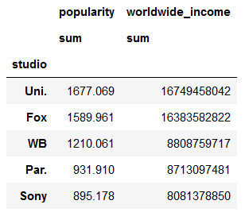

# Project Drescription:
Microsoft is getting into the movie business and they need some recommendations to maximize profits. Using data from popular movie sites I came up with 4 business questions. 

**Question 1 what is the state of the movie business?**

**Question 2 which genre(s) generate the most income?**

**Question 3 which Studio generates the most income for most successful genre in question 2?**

**Question 4 what combination of studio and writer generate the most income for the genre highlighted by question 2?**

# Definitions and assumptions:

**Worldwide_income** : is a measure of how much profit is left over after initial budget is taken into account. It is calcualted by the difference between worldwide_gross and production_budget. It is measured in dollars.  

**Gross_return** : is a measure of how many dollars are returned as profit (worldwide_income) for every production budget dollar invested. Said otherwise, its the ratio of worldwide_income / production_budget. It is measured in dollars. 

**Total_Rank** : is a measure of a movie's combined normalized worldwide_income and gross_return. The thinking behind this is that I would like to desribe the success of a movie not only as a function of worldwide_income, but also in the effeciency of its ability to convert dollars invested into dollars returned. 

**On Genres** : The origional data set listed genre entries as either single or composite themes, for example drama is a single entry, while adventure/animation/comedy is a composite theme. I choose to keep these togther as opposed to separating them or just using the first one listed. My thought was that if they are categorized as composite and I just used the first genre listed(adventure in this case), my results would loose some accuracy.

# Data:

I used 4 sources of data:

1. IMBD
2. Box Office Mojo
3. Rotten Tomatoes
4. The Numbers

The **zippedData** folder has the aforementioned sources. 

# Procedure:

Here I decided to merge all the data first. Then I removed duplicates, extra columns, na rows, and outliers. I created some columns to aid in analysis. Finally I performed a 2 level rank then sort. 

1.) **Import** data using the **glob process** and a **function created to make dataframes for each data set**.


```python
Image(filename='images/data import, reformat, dataframe creation code.PNG') 
```


The base of each of my recommendations was a question of profitibilty. There where 2 tables that had budget and gross world wide income figures namely, **tn_movie_budgets__gz** and **bom_movie_gross__gz**.

Inspecting these tables I found that the **tn_movie_budgets__gz data** had more **rows** and this data had **0 null values** which made it the obvious choice to start the joins. 

**tn_movie_budgets__gz:**


```python
#!(tn_movie_budgets__gz.info().PNG)
from IPython.display import Image
Image(filename='images/tn_movie_budgets_gz.info().png') 
```


2.) **Combine** tn_movie_budgets_gz dataframe with bom_movie_gross_gz dataframe to get studio column. I used a **left join on name of movie**. 


```python
Image(filename='images/budget and studio join.png') 
```


3.) **reset index** of imbd_title_basics as the **tconst column** so that other dataframes can be joined using this id


```python
Image(filename='images/imbd_title_basics_gz_reset_index.PNG') 
```


4.) **Combine** tn_movie_budgets_gz dataframe with imdb_title_basics__gz dataframe.  


```python
Image(filename='images/genre and budget join.PNG') 
```


5.) **Combine** tn_movie_budgets_gz dataframe with imdb_title_crew__gz dataframe. First I mad sure to **reset the index** so that I can **join on tconst**. Then I executed the merge. 


```python
Image(filename='images/reset crew index as tconst.PNG') 
```


```python
6.) Remove unnessesary columns.
```


```python
Image(filename='images/drop columns.PNG')
```


7.) Drop all NA rows. I elected to drop these because there was not enough data to fill in missing values using mean. This drastically reduced row count by around 75%.


```python
Image(filename='images/drop na rows.PNG')
```


8.) Use a **lambda function** to reformat all budget related columns and convert to **integers**. 


```python
Image(filename='images/convert budjet rows to integers.PNG')
```


9.) **Create** a new column called worldwide_income. That is the income realized after production budget costs are taken into account. 


```python
Image(filename='images/worldwide_income column creation.PNG')
```


10.) **Remove** unprofitable movies, by creating a slice of the tn_movie_budgets_gz dataframe which is filtered for movies which have a non-zero profit. The results were verified by retuning the min value from the worldwide_income column.


```python
Image(filename='images/remove unprofitable movies.PNG')
```


11.) **Duplicate** removal was acheived by sorting the list by movie and year. Then the duplicates were dropped. 


```python
Image(filename='images/sort for duplicates.PNG')
```


```python
Image(filename='images/drop duplicates.PNG')
```


12.) **Identify** outliers by calculating the z-score and filling a column with these scores. 


```python
Image(filename='images/identifying outliers.PNG')
```


13.) **Remove** outliers by filtering the tn_movie_budgets_gz dataframe for any z score which is below 3 standard deviations. 


```python
Image(filename='images/removing outliers.PNG')
```


14.) **Verify** that outliers have been removed


```python
Image(filename='images/verification that outliers have been removed.PNG')
```


15.) **Repeat** steps 12-15 for worldwide_income and worldwide_gross columns

16.) **Create** a new column which shows the number of dollars returned as income for every dollar invested in the budget. 


```python
Image(filename='images/gross return column.PNG')
```


17.) **Normalize Data** by using the min-max method to perserve scale of data, and since outliers were delt with earlier this is better then z-score approach.


```python
Image(filename='images/Normalize data.PNG')
```


18.) **Repeat** step 16 for worldwide_income and gross_return column

19.) **Create** a column Total_Rank which is the 2 level rank of the normalized values from the worldwide_income_norm and gross_income columns. Note that a simple sort will not work here becuase the worldwide income column will overtake the gross income columns. Essentially what this does is concatenates the normalized values form worldwide_income and gross_return columns and ranks them on their total value as a string. Then it Ranks them in decending fashion and converts them back to an integer.   


```python
Image(filename='images/Total_Rank.PNG')
```


20.) **Sort** by Total_Rank


```python
Image(filename='images/sorted by total rank.PNG')
```


21.) **Create** date columns.


```python
Image(filename='images/release date to month.PNG')
```


22.) **Create** week number column


```python
Image(filename='images/week column.png')
```


# Question 1 what is the state of the movie business?

**Looks like that are large swings in production budget and worldwide income generated. It is imperative that microsoft pick a specific movie genre and carefully picks studio, director, and writer to ensure successful return on investment.**

1.) **Slice** the tn_moive_budgets_gz dataframe to omit the years before 2006. 


```python
Image(filename='images/slice of dataframe.png')
```


2.) **Plot** production budget and worldwide income data for all movies by year.


```python
Image(filename='images/worldwide_income and production budget groupby year plot.png')
```


```python
Image(filename='images/production budget and gross income.png')
```


Looks like movie budgets and worldwide income are in decline from a peak of 2011. Which makes it vital to choose the most lucrative genre.

3.) **Plot** the average return on each dollar invested for all movies.


```python
Image(filename='images/mean profit dollars from each budget dollar invested.png')
```


Again there are large differences in income per budget dollars invested. 

4.) **Plot** the average budget per year for all movies. 


```python
Image(filename='images/average production budget by year.png')
```


**Findings for question 1:
   -Income looks somewhat positively corrolated to production budget. 
   -There are large fluctations in initial investment, and return. 
   -Atleast for the last decade there is a decline in investment and profits.

# Question 2 what are the most profitable genre(s)

**Looks like the most profitable genre is Adventure/Animation/Comedy.**

1.) **Plot** the most lucrative genre by cumulative production budget and worldwide income by year. I ultilized a groupby for this. 


```python
Image(filename='images/top 5 most profitable genres code.png')
```


```python
Image(filename='images/top 5 genres plot.png')
```


# Question 3 which studio makes the most profitable adventure/animation/comedy films. 

**Fox** movie studio is the clear winner here. 

1.) **Plot** the studio which generates the most profit for the adventure/animation/comedy genre. Again I used a groupby here on studio and aggregated sum and mean over cumulative worldwide_income column. 


```python
Image(filename='images/top 5 movie studio that makes adventure.animation.comedy films.png') 
```


```python
Image(filename='images/plot of most successful studio for adventure.animation.comedy genre.png')
```


# Question 4 what is the most successful director/writer combo for the adventure/animation/comedy genre


**Findings for question 4**

1.)**Director id nm0757858** is the right choice since they made 3 movies. Though I did want to note that director codes       nm0166256,nm0930261,nm0615780,nm2320658 were involved with directing **Mona - the highest Ranked movie**.

2.)**Any of the top 3 writers would be a good choice.** There is no distinct difference between them.


1.) **Create** a table of highest income generating directors. 


```python
Image(filename='images/table of top 3 directors for adventure.animation.comedy genre.png')
```


2.) **Create** a table of the highest income generating directors for the adventure.animation.comedy genre. 


```python
Image(filename='images/table of top 3 writers for the adventure.animation.comedy genre.png')
```


# Recomendations for Microsoft

**Question 1** what is the current state of the movie business? 

Due to the **large yearly swings in investment and profit** in the movie business its important to follow a data diven decision making approach. 

**Question 2** what is the best movie genre by worldwide profit? 

The **Adventure/animation/comedy genre** is the most lucrative. 

**Question 3** what is the most successful studio for making Adventure/animation/comedy films. 

**Fox** makes the most money in the Adventure/animation/comedy genre. 

**Question 4** which writer director combination will yeild the greatest return? 

**Director id nm0757858 is the top director in the Adventure/animation/comedy genre.** There is no clear writer which have an advantage. 

# Future Work

**What is the relationship between popularity and worldwide income?** 

The following table of the top top studios by cumulative worldwide income and sum of popularity, shows that as as popularity goes up so does worldwide_income. 


```python
Image(filename='images/table of top studios by worldwide income and sumof popularity.png')
```





**Looking at the corrolation analysis for the tn_movie_budgets_gz dataframe you'll see that there is a mediumn (0.4) corrolation between worldwide_income and popularity.**


```python
Image(filename='images/corrolation analysis.png')
```


